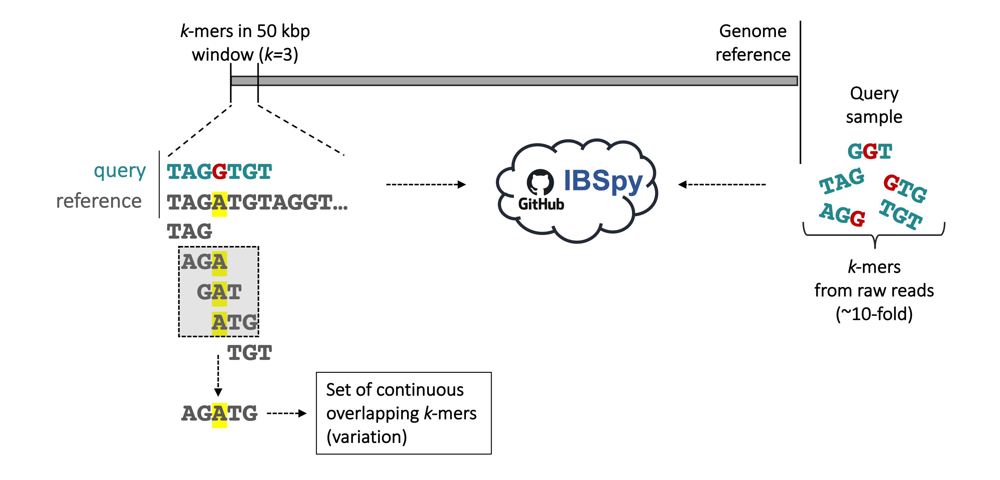

# Analysis to detect *Triticum monococcum* introgressions into domesticated hexaploid wheat.

Scripts used in the publication ***"Einkorn genomics sheds light on evolutionary history of the oldest domesticated wheat"***.

## We used two methods:
### A). Our first method involves a *k*-mer mapping based approach.
```
Author: H. Ahmed
Date: 26/07/2022
```
Input data used: whole-genome sequencing data from all domesticated einkorn accessions (61 *T. monococcum* accessions) and 30 *T. urartu* accessions from Zhou *et al.,* (2020) https://www.nature.com/articles/s41588-020-00722-w: 


1.	Count *k*-mers from each accession using ```jellyfish``` (https://github.com/gmarcais/Jellyfish).
We used *k*-mer length of 51.

```sh
# Example:
zcat accession.fq.gz | \
jellyfish count \
-C \
-m 51 \
-s 3G \
-t 32 \
-o accession_51mer_count.jf /dev/fd/0
```

2.	Obtain *k*-mers sequences and remove unique.

```sh
# Example: 
jellyfish dump \
-L 2 \
-ct accession_51mer_count.jf > accession.dump.txt
```

3.	Concatenate all *k*-mers from all accessions per species (all domesticated einkorn, and all *T. urartu*, separately) and keep one representative of each *k*-mer

```sh
# Example: 
xargs awk '{print $1}' < list_accession_monococcum.txt | \
awk '!seen[$0]++' > all_kmers_moonococcum.txt
```

4.	Obtain unique *T. monococcum* *k*-mers (i.e., *k*-mers present only on *T. monococcum* and not *T. urartu*)  – This step is repeated to obtain unique *T. urartu* *k*-mers

```sh
# Example:
awk 'NR==FNR{a[$0];next}!($0 in a)' all_kmers_urartu.txt all_kmers_monococcum.txt > kmers_monococcum_uniq.txt
```
Obtaining unique *k*-mers from *T. monococcum* allows to exclude regions that are similar to *T. urartu* (the A-genome donor) 

5.	Create fasta file from the list of *k*-mers

```sh
# Example to create fasta file for *T. monococcum*:
awk 'BEGIN{cont=0}{printf ">mer_%d\n",cont; print $0;cont++}' kmers_monococcum_uniq.txt > kmers_monococcum_uniq.fa
```

6.	Mapping *k*-mers to the bread wheat reference assembly
```sh
# Example:
bwa mem \
-t 16 \
-k 51 \
-T 51 \
-M ArinaLrFor_subgenomeA.fasta kmers_monococcum_uniq.fa | \
samtools view \
-bSh - | \
samtools sort \
-o kmer_monococcum_uniq_againstRef_ArinaLrFor.bam 
```
Note: Only the A-subgenome was used as a reference. The same steps will be repeated, but mapping *T. urartu* *k*-mers to the bread wheat genome assembly

7.	Analyze the depth of mapped *k*-mers in a 1 Mb non-overlapping genomic window for each species (we will be looking at introgressed segments with a mega-base resolution). For this, we used ```mosdepth``` (https://github.com/brentp/mosdepth).

```sh
# Example:
mosdepth \
-t 16 \
--by ArinaLrFor_1mb.bed ./kmer_monococcum_againstRef_ArinaLrFor_depth_1Mb kmer_monococcum_uniq_againstRef_ArinaLrFor.bam
```
ArinaLrFor_1mb.bed is a tab-delimited text file that defines the start and end of each genomic window.
Example:
chr1A	1	1000000


### B). In our second approach we employed IBSpy (Identity-by-State in python).
```
Author: H. Ahmed, J. Quiroz-Chavez, R. Ramirez-Gonzalez, C. Uauy, S. Krattinger
Date: 26/07/2022
```

IBSpy is a *k*-mer based software that allows to detect introgressions at 50-kbp resolution. For details about how IBSpy detects variations, please, read the documentation [here](https://github.com/Uauy-Lab/IBSpy).\



```In brief, using 50 kbp windows, we compared k-mers in a reference sequence to the k-mers of any query sample (raw reads or assemblies) and count the number of variations within each window. A variation is defined as a set of continuous overlapping k-mers (k = 3 in this example) from the reference completely absent in the query. Low variations count indicates high similarity between the 50 kbp reference window in the assembly and the query sample, whereas high variation counts indicate low sequence similarities.```


We used the 218 accessions of *T. monococcum* sequenced in this study as a query samples. On average all samples had ```~10-fold coverage```. We also included the ten wheat genome assemblies (Walkowiak *et al.,* 2020) and two chromosome-scale *T. monococcum* assemblies from this study. We included the assemblies, either as a reference or as query samples.


1. Build *k*-mer databases.\
We used kmc-3.0.1
	* ```script: run_kmc.sh```
- Example for genome assembly:

```sh
kmc -k31 \
-ci1 \
-m30 \
-t5 \
-fm assembly_id.fa assembly_id out_dir
```
- Example for raw reads:
```sh
accesion_id='accesion1'
in_dir=../${accesion_id}

kmc -k31 \
-ci1 \
-m30 \
-t5 \
-fq <(ls -d $in_dir/*.gz) accesion_id out_dir
```

2. Detect variations.\
We employed IBSpy (IBSpy-0.3.1) to quantify variations in 50-kbp windows.
	* ``` script: run_IBSpy.sh ```

```sh
# Example
IBSpy --kmer_size 31 \
--window_size 50000 \
--reference reference1.fa \
--database accesion1 \
--database_format kmc3 \
--output accesion1_vs_reference1_50000.tsv \
--compress
```

3. Combine IBSpy output tables by window & reference.\
	* ```script: run_combine.sh```\
	This is to process a single table in downstream analysis. The script requires a metadata file with the name of the individual IBSpy output files with their corresponding names. See the ```metadata.tsv``` example. All the individual files will be combined by reference at arbitrary windows size.

```sh
# Example
python3 combine_by_windows.py \
-i metadata.tsv \
-r reference_name \
-w 50000 \
-s variations \
-o reference_combined_queries_50000.tsv.gz
```

The list below are examples of the output files which correspond to the variations tables of the whole genome combined by reference. They are publicly available ``` here(link)```

	- arinalrfor_combined_queries_50000w.tsv.gz
	- chinese_combined_queries_50000w.tsv.gz
	- jagger_combined_queries_50000w.tsv.gz
	- julius_combined_queries_50000w.tsv.gz
	- lancer_combined_queries_50000w.tsv.gz
	- landmark_combined_queries_50000w.tsv.gz
	- mace_combined_queries_50000w.tsv.gz
	- norin61_combined_queries_50000w.tsv.gz
	- spelta_combined_queries_50000w.tsv.gz
	- stanley_combined_queries_50000w.tsv.gz
	- sy_mattis_combined_queries_50000w.tsv.gz

4. Define monococcum introgressions.\
To process downstream and plot introgressions across chromosomes we used a python & R notebook scripts. Please, see ``` monococcum_min_variations.ipynb ``` jupyter notebooks & R scripts. For the full description about how the introgressions were defined using IBSpy, please see **Supplementary Note 2**.